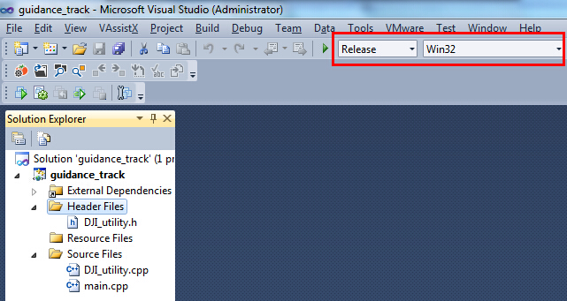
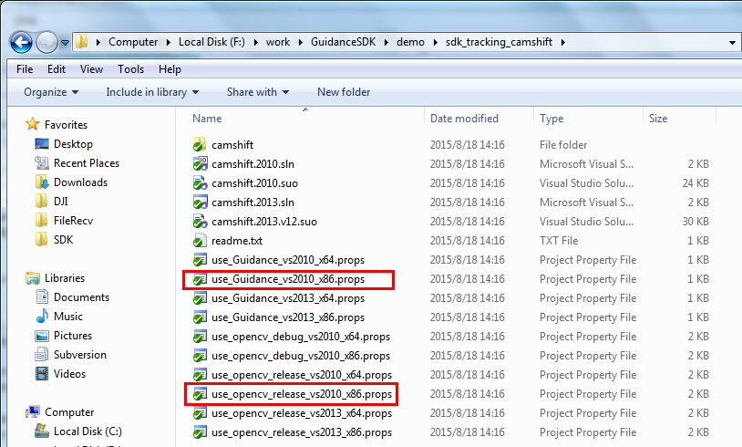
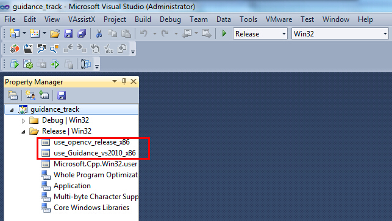
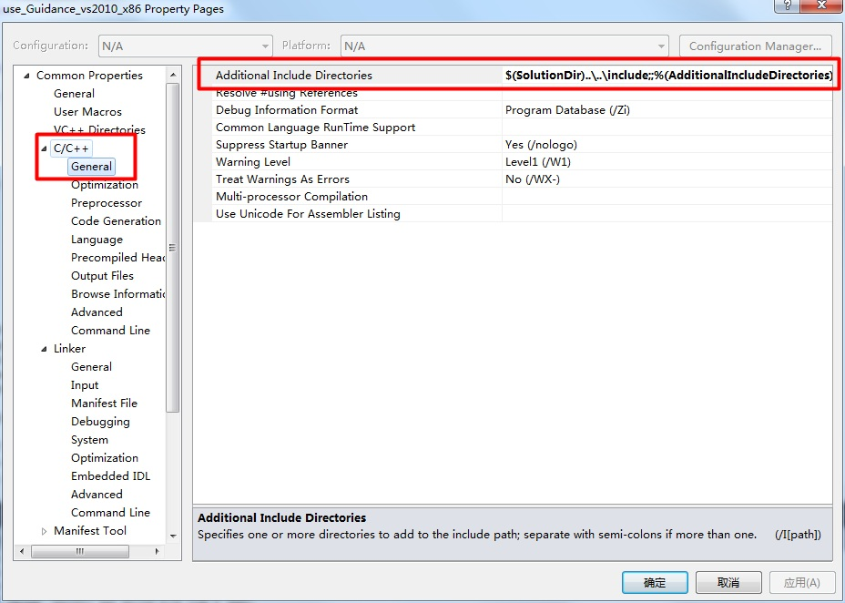
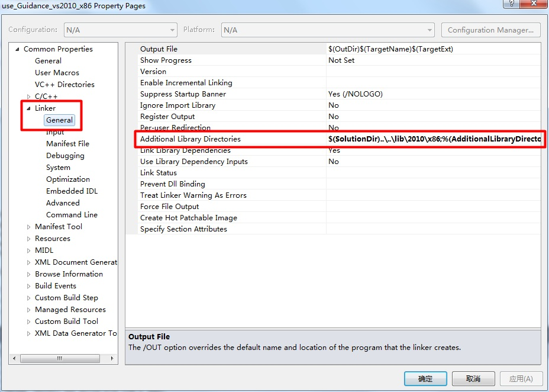
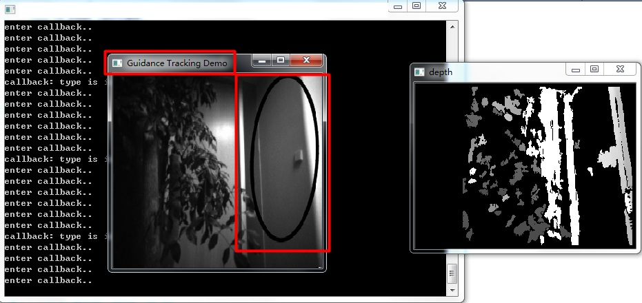

This tutorial gives an example of building a visual tracking project using Guidance SDK step by step. It supports Windows and Linux.

A complete visual tracking project is already included in the **demo** folder. The user is encouraged to build and run the project first to get a feeling of how it would work. Then follow the instructions below to get the knowledge of how to build a Guidance SDK project from scratch. 

## Download and unzip SDK

Latest version of SDK is available on GitHub and then decompress it: <a href="https://github.com/dji-sdk/GuidanceSDK" target="_blank">Guidance SDK</a>.

The content includes：

-	**demo**: a visual tracking project by using Guidance SDK
-	**doc**: API details
-	**examples**: examples for USB, UART and ROS
-	**include**: header file of Guidance SDK 
-	**lib**: library files for Windows
-	**so**: library files for Linux

## Windows

### 1. Create a project named “guidanceSDK\_test”

Create an empty project in VS2010 in directory **“demo”** named **“guidance\_track”**.
 
  

### 2. Add .h and .cpp to project

#### 2.1 Add main.cpp

Add an empty **main.cpp** to project first.

#### 2.2 Add DJI\_utility.h and DJI\_utility.cpp

Copy the thread security related files **DJI\_utility.cpp** and **DJI\_utility.h** to the same directory as **main.cpp**, and add them in vs2010. DJI\_utility.cpp and DJI\_utility.h can be found both in **SDK/demo** and **SDK/examples**.
 
- Find **DJI\_utility.h** and **DJI\_utility.cpp** in **demo/sdk\_tracking\_camshift/camshift**.
- Copy DJI\_utility files to project path, and add DJI\_utility files to the project:

 

 

#### 2.3 Configure the Include and Library path

Now we need to configure **DJI\_guidance.h**, **DJI\_guidance.lib** and **OpenCV** related path.
**DJI\_guidance.h** is in **include**, **DJI\_guidance.lib** is in **lib**. **DJI\_guidance.lib** in **lib/2010/x86** is going to be used here as we will run programs in **Release | Win32** mode.
 
- Find the configuration of Visual Studio 2010, which is **Release | Win32**:
	
 
	
- Find **DJI\_guidance.h** is in **include** and copy to project directory.
- Find **DJI\_guidance.lib** in **lib/2010/x86** and copy to project directory.
- Add OpenCV related header and library path to the project.
	
To simplify the configuration, we can copy the property sheets
**“use\_opencv\_release\_vs2010\_x86.props”** 
**“use\_Guidance\_vs2010\_x86.props”** 
in **demo/sdk\_tracking\_camshift** to the solution directory and add to the new project. 

- Find **“use\_opencv\_release\_vs2010\_x86.props”** and 
**“use\_Guidance\_vs2010\_x86.props”**  in sdk\_tracking\_camshift:

 

- Copy the property sheet files to the solution directory

 

- Switch the toolbar to **“Property Manager”** as shown below. Right-click the **Release | Win32**, and click the **“Add Existing Property Sheet”**， then add:
**“use\_opencv\_release\_vs2010\_x86.props”**
**“use\_Guidance\_vs2010\_x86.props”** 
to the new project.	

 

>*Attention: Make sure you have installed OpenCV, and set up the environment  variable OPENCVROOT properly, which is used by the OpenCV property sheet.*

Users can modify the property sheet to adapt to changes of the path of project. Here gives a look at the path of Include and Library of Guidance SDK. 
 
- Include path of Guidance SDK in“use\_Guidance\_vs2010\_x86.props” 
	
 

- Library path of Guidance SDK in “use\_Guidance\_vs2010\_x86.props” 

  

### 3. Configure dynamic library

Copy the DJI\_guidance.dll from **SDK/lib/2010/x86** to the **bin** folder of our project.

 

### 4. Edit main.cpp

- 	Add the necessary headers to **main.cpp** first. **DJI\_guidance.h** is for Guidance SDK, **DJI\_utility.h** is for thread security, and **OpenCV** related headers are for image processing. 

~~~cpp
#include "opencv2/video/tracking.hpp"
#include "opencv2/imgproc/imgproc.hpp"
#include "opencv2/highgui/highgui.hpp"
#include "opencv2/calib3d/calib3d.hpp"
#include <fstream>
#include <iostream>
#include "DJI_guidance.h"
#include "DJI_utility.h"

using namespace cv;
using namespace std;
~~~

- Declare global variables that will be used in different threads. **Image** stores the data transferred and the result, **g\_lock** provides thread security functions, **g\_event** gives the method to respond to data transfer event, **selection** is declared for user to select object to track, **WIDTH**, **HEIGHT** and **IMAGE\_SIZE** are the size of the images. 

~~~cpp
Mat image;

bool selectObject = false;
int trackObject = 0;
Point origin;
Rect selection;
DJI_event g_event;
DJI_lock g_lock;

#define WIDTH 320
#define HEIGHT 240
#define IMAGE_SIZE (HEIGHT * WIDTH)
~~~

- Then define an object selection function using mouse, which enables users to easyly select the object to track at the beginning of data transfer. 

~~~cpp
static void onMouse( int event, int x, int y, int, void* )
{
    if( selectObject )
    {
        selection.x = MIN(x, origin.x);
        selection.y = MIN(y, origin.y);
        selection.width = std::abs(x - origin.x);
        selection.height = std::abs(y - origin.y);
    
        selection &= Rect(0, 0, image.cols, image.rows);
    }
    
    switch( event )
    {
    case CV_EVENT_LBUTTONDOWN:
        origin = Point(x,y);
        selection = Rect(x,y,0,0);
        selectObject = true;
        break;
    case CV_EVENT_LBUTTONUP:
        selectObject = false;
        if( selection.width > 0 && selection.height > 0 )
        trackObject = -1;
        break;
    }
}
~~~

- Here provides a help function, which is for showing the information of how this program works in the mode of Windows Console. User can get the help information as follows:

~~~
guidanceSDK_test.exe -h
~~~

Help function prototype: 

~~~cpp
static void help()
{
    cout << "\nThis is a demo that shows camshift based tracking with Guidance.\n"
          "You select an objects such as your face and it tracks it.\n"
          "This reads from greyscale and depth images from DJI Guidance.\n"
          "Usage: \n"
          "   ./camshift.exe\n";

    cout << "\n\nHot keys: \n"
          "\tESC/q - quit the program\n"
          "\tc - stop the tracking\n"
          "\tb - switch to/from backprojection view\n"
          "\tp - pause video\n"
          "To initialize tracking, select the object with mouse\n";
}
~~~

Since this tutorial gives a demo of camshift based tracking using depth image, users need to select object to track when the program starts with the window of **“Guidance Tracking Demo”**, and then the result will be shown. 
 
  

-	Now we define a callback function, which will be called when the subscribed data comes. **Users should only write light-weight processing functions in the callback function, such as data copy, otherwise the data transfer frequency will be slowed down.**

~~~cpp
Mat g_imleft(HEIGHT, WIDTH, CV_8U);
Mat g_imright(HEIGHT, WIDTH, CV_8U);
Mat g_depth(HEIGHT, WIDTH, CV_16SC1);
e_vbus_index selected_vbus = e_vbus1;  // select front vbus
string winDemoName = "Guidance Tracking Demo";

int my_callback( int data_type, int data_len, char *content )
{
        printf("enter callback..\n");
        g_lock.enter();
        if ( e_image == data_type && NULL != content )
        {
            printf("callback: type is image..\n");
            image_data data;
            memcpy((char*)&data, content, sizeof(data));
            memcpy(g_imleft.data, data.m_greyscale_image_left[selected_vbus], IMAGE_SIZE);
            memcpy(g_imright.data, data.m_greyscale_image_right[selected_vbus], IMAGE_SIZE);
            memcpy(g_depth.data, data.m_depth_image[selected_vbus], IMAGE_SIZE * 2);
        }
        g_lock.leave();
        g_event.set_event();
        return 0;
}
~~~

-	Most Guidance SDK functions return an **int** type error code, non-zero if functions called fail, e.g. **init_transfer()**, **start_tansfer()**, which enables the user to determine the reason when error occurs. Here we write two macros, to print the error code or directly quit the program if error occurs.

~~~cpp
#define RETURN_IF_ERR(err_code) { if( err_code ){ printf( "USB error code:%d in file %s %d\n", err_code, __FILE__, __LINE__ );}}
    
#define RELEASE_IF_ERR(err_code) { if( err_code ){ release_transfer(); printf( "USB error code:%d in file %s %d\n", err_code, __FILE__, __LINE__ );}}
~~~

-   Initialization, data subscription, data transfer start, image process, data transfer release and so on in main function.

~~~cpp
int main( int argc, const char** argv )
{
    /* help */
    if(argc>1)
        help();

    /* Ready to write video */
    VideoWriter vWriter("result.avi", CV_FOURCC('M','J','P','G'), 25, Size(WIDTH, HEIGHT), false);
    /* tracking box */
    Rect trackWindow;
    int hsize[] = {16, 16};
    float hranges[] = {0, 255};
    float dranges[] = {0, 255};
    
    const float* phranges[] = { hranges, dranges };
    
    selection = Rect(10,10,100,100);
    trackObject = 0;
    
    namedWindow( winDemoName, 0 );
    /* set mouse event callback */
    setMouseCallback( winDemoName, onMouse, 0 );
    
    Mat imcolor, mask, hist, hist_of_object, backproj;
    bool paused = false;
    float hist_update_ratio = 0.2f;
    
    /* Reset the configuration of data transfer */
    reset_config();
    int err_code = init_transfer();
    RETURN_IF_ERR(err_code);
    /* subscribes left grey-image of selected_vbus */    
    err_code = select_greyscale_image(selected_vbus, true);
    RELEASE_IF_ERR(err_code);
    /* subscribes right grey-image of selected_vbus */    
    err_code = select_greyscale_image(selected_vbus, false);
    RELEASE_IF_ERR(err_code);
    /* subscribes depth image of selected_vbus */
    err_code = select_depth_image(selected_vbus);
    RELEASE_IF_ERR(err_code);
    /* set callback of data transfer */
    err_code = set_sdk_event_handler(my_callback);
    RELEASE_IF_ERR(err_code);
    /* start data transfer */
    err_code = start_transfer();
    RELEASE_IF_ERR(err_code);
    
    Mat depth(HEIGHT, WIDTH, CV_8UC1);
    /* set loops of data transfer */
    for( int times = 0; times < 30000; ++times )
    {
        /* wait until data comes */
        g_event.wait_event();
    
        // filter depth image
        filterSpeckles(g_depth, -16, 50, 20);
        // convert 16 bit depth image to 8 bit
        g_depth.convertTo(depth, CV_8UC1);
        /* depth image show */
        imshow("depth", depth);
        waitKey(1);
        /* copy the grey-image to image */
        g_imleft.copyTo(image);
    
        if( !paused )
        {
            vector<Mat> ims(3);
            ims[0] = image;
            ims[1] = ims[2] = depth;
            merge(ims, imcolor);
            /* start tracking if object selected */
            if( trackObject )
            {
                int ch[] = {0,1};
                if( trackObject < 0 )
                {
                    Mat roi(imcolor, selection);
                    
                    calcHist(&roi, 1, &ch[0], Mat(), hist, 2, &hsize[0], &phranges[0]);
                    normalize(hist, hist, 0, 255, CV_MINMAX);
    
                    if(hist_of_object.empty())
                        hist_of_object = hist;
                    else
                        hist_of_object = (1-hist_update_ratio)*hist_of_object + hist_update_ratio*hist;
    
                    trackWindow = selection;
                    trackObject = 1;
                }
    
                calcBackProject(&imcolor, 1, ch, hist_of_object, backproj, phranges);
                RotatedRect trackBox = CamShift(backproj, trackWindow,
                                    TermCriteria( CV_TERMCRIT_EPS | CV_TERMCRIT_ITER, 10, 1 ));
                
                if (trackWindow.area() <= 1)
                {
                    int cols = backproj.cols, rows = backproj.rows, r = (MIN(cols, rows) + 5)/6;
                    trackWindow = Rect(trackWindow.x - r, trackWindow.y - r,
                                       trackWindow.x + r, trackWindow.y + r) &
                                  Rect(0, 0, cols, rows);
                }
                if( trackWindow.area() <= 1 )
                    break;
    
                ellipse( image, trackBox, Scalar(0,0,255), 3, CV_AA );
            }
            else if( trackObject < 0 )
            {
                paused = false;
            }
        }
    
        if( selectObject && selection.width > 0 && selection.height > 0 )
        {
            Mat roi(image, selection);
            bitwise_not(roi, roi);
        }
    
        imshow( winDemoName, image );
        vWriter<<image;
    
        char c = (char)waitKey(10);
        /* press ‘q’ to quit program */
        if( c == 27 || c=='q')
        {
            break;
        }
        switch(c)
        {
        case 'c':
            trackObject = 0;            
            break;
        case 'p':
        case ' ':
            paused = !paused;
            break;
        default:
            ;
        }
    }
    /* stop data transfer */
    err_code = stop_transfer();
    RELEASE_IF_ERR(err_code);
    /* make sure data transfer stopped */
    sleep(100000);
    /* release data transfer thread */
    err_code = release_transfer();
    RETURN_IF_ERR(err_code);
    
    return 0;
}
~~~

### 5. Build and Run

>*Make sure the environment has been set up properly.* 

One can click the **“Build”** and then **“Start Debugging”** after connecting and starting the Guidance. 

## Linux

### 1. Download SDK package and create a project directory

- Download the SDK package to `~/Desktop/GuidanceSDK`. 
- Create a directory `~/Desktop/SDK/demo/guidance_track`, and copy **DJI\_utility.cpp**, **DJI\_utility.h** and **main.cpp** created under Windows to this directory.
	
		mkdir ~/Desktop/GuidanceSDK/demo/guidance_track
		cd ~/Desktop/SDK/demo/guidance_track
 
 

### 2. Copy libDJI\_guidance.so

Suppose the operating system is **Ubuntu14.04 32bit**. Copy the **libDJI\_guidance.so** from **so/x86** to **usr/local/lib**. Notice that `sudo` is necessary to copy these files to `/usr/local/lib`:

~~~
sudo cp ~/Desktop/GuidanceSDK/so/x86/libDJI_guidance.so /usr/local/lib
~~~

### 3. Edit Makefile

Create a Makefile in the project directory. Make sure OpenCV has been installed.

~~~
gedit Makefile
~~~

Code of Makefile: 

~~~
#define a compiler
CXX     = g++
#define target name
TARGET  = main
#define dependencies of target 
OBJECTS = main.o DJI_utility.o
#define the Include and Library path
CFLAGS  = -g -Wall -I/usr/local/include -I../../../include
LDFLAGS = -Wl,-rpath,./ -lpthread -lrt -L./ -L/usr/local/lib/ -lDJI_guidance -lusb-1.0 `pkg-config --cflags --libs opencv` 
    
$(TARGET) : $(OBJECTS)
    $(CXX) -o $(TARGET) $(OBJECTS) $(LDFLAGS)
main.o : main.cpp DJI_utility.h
    $(CXX) $(CFLAGS) -c main.cpp DJI_utility.h
DJI_utility.o : DJI_utility.cpp DJI_utility.h
    $(CXX) $(CFLAGS) -c DJI_utility.cpp DJI_utility.h
clean:
    rm -rf *.o *.gch *.avi $(TARGET)
~~~

### 4. Make and run

- Power up Guidance, and connect it to computer via USB.
- Make and run the project:

~~~
make
./main
~~~

- Draw the object box with mouse when program is running. One could see pictures as follows if everything goes well. 

	 

- Type `q` on keyboard will quit the program. 
